> **Отчет по лабораторной работе №1 базовая настройка PostgreSQL на
> Debian**
>
> **Костина Е.А. ИС-21**
>
> **1. Подготовка среды**

1.  apt-get update

> Обновляет список доступных пакетов из репозиториев

2.  apt-get upgrade

Устанавливает обновления для всех имеющихся пакетов

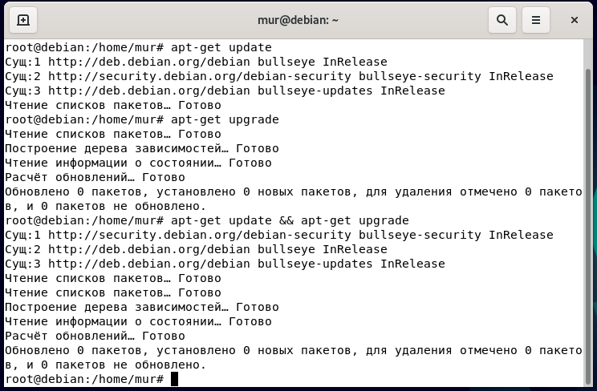

**2. Установка PostgreSQL**

apt-get install postgresql -- установка postgreSQL

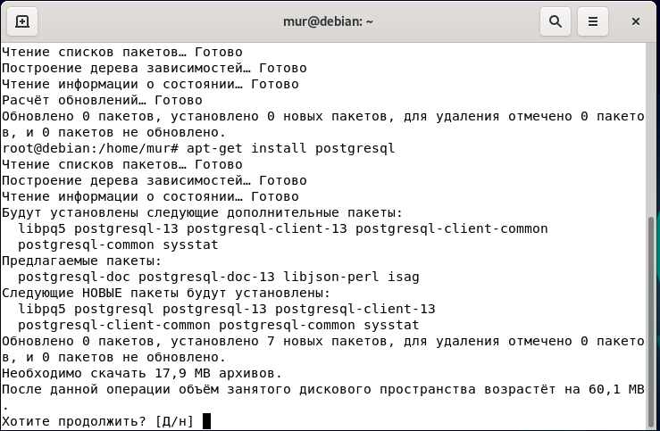

apt-get install PostgreSQL-client установка клиентского пакета

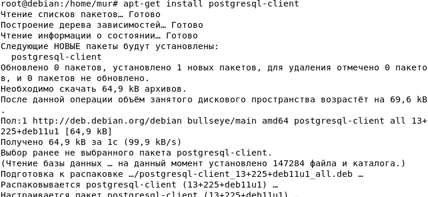

systemctl status PostgreSQL -- проверка статуса

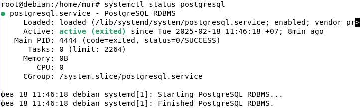

systemctl stop PostgreSQL остановка службы

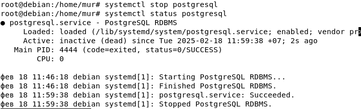

**3. Создание служебной учётной записи**

**cat /etc/passwd** -- выводит содержимое файла /etc/passwd, где
хранятся сведения о пользователях системы

Для администрирования бд заходим под учётку админа sudo -i -u postgres

Потом запускаем psql

\\q выход из psql

Exit выход из учётки админа БД

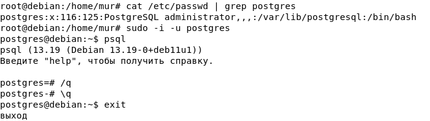

Пользователь postgres в системе:

1.  **Не имеет привилегий root**, но управляет PostgreSQL.

2.  **Обладает полными правами на базы данных PostgreSQL**.

3.  **Не может использовать sudo**, так как это обычный системный
    пользователь.

4.  **Может запускать psql без пароля**, так как является владельцем
    сервера БД.

> **4. Первичная настройка конфигурационных файлов**

sudo nano /etc/postgresql/13/main/postgresql.conf

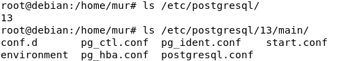

Редактируем файл с настройками сервера меняем порт с 5432 на 5436

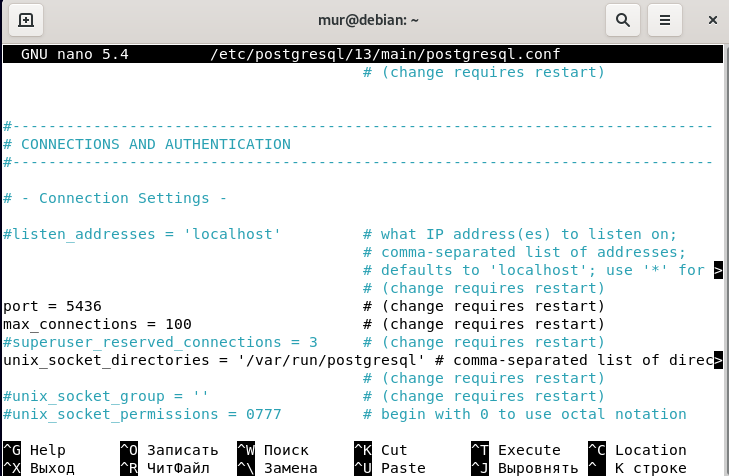

перезагружаем PostgreSQL

**Основные файлы конфигурации**

*postgresql.conf* -- Основные настройки сервера

Этот файл управляет параметрами работы PostgreSQL, такими как:

-   порт (port)

-   логирование (logging_collector, log_statement)

-   настройки памяти (shared_buffers, work_mem)

-   количество подключений (max_connections)

-   параметры сетевого доступа (listen_addresses)

*pg_hba.conf* -- настройки аутентификации.

этот файл определяет, какие пользователи могут подключаться, с каких
адресов и с каким методом аутентификации.

*pg_ident.conf* -- связывает системных и базовых пользователей.

Этот файл позволяет привязать системные учётные записи Linux к
пользователям PostgreSQL.

5.  **Управление сервисом**

Проверить статус: systemctl status postgresql

Запустить сервер: sudo systemctl start postgresql

Остановить сервер: sudo systemctl stop postgresql

Перезапустить сервер: sudo systemctl restart postgresql

Добавить в автозапуск: sudo systemctl enable postgresql

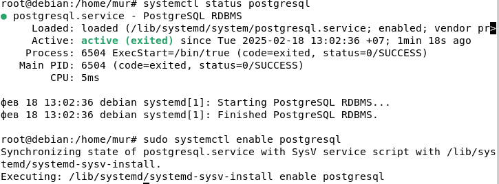

6.  **Создание тестовой базы данных**

CREATE USER kostine WITH PASSWORD \'4554\';

CREATE DATABASE dbkostine OWNER kostine;

Список пользователей: \\du

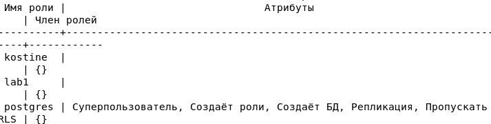

Список баз данных: \\l

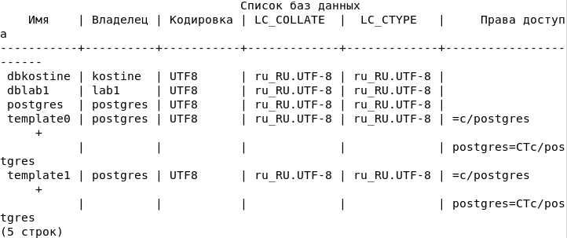

psql -U kostine -d dbkostine -W

psql: ошибка: ВАЖНО: пользователь \"lab1\" не прошёл проверку
подлинности (Peer)

PostgreSQL использует **одноранговую аутентификацию**, а пользователь
\"lab1\" не совпадает с системным пользователем Linux

sudo nano /etc/postgresql/13/main/pg_hba.conf

Найди строку:

local all all peer меняем на md5

Перезагружаем

sudo systemctl restart postgresql

И подключаемся

**7. Знакомство со схемами**

Создадим новую схему

CREATE SCHEMA test_schema;

Назначаем права пользователю

GRANT USAGE ON SCHEMA test_schema TO kostine;

GRANT CREATE ON SCHEMA test_schema TO kostine;

SELECT \* FROM test_schema.public;

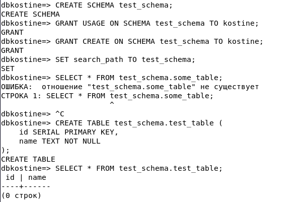

В PostgreSQL **схема** -- это логическая структура внутри базы данных,
которая **группирует объекты**, такие как **таблицы, представления,
индексы, функции** и т. д.

Схема в PostgreSQL похожа на **папку** внутри базы данных. Она позволяет
организовывать объекты и управлять доступом к ним.

Допустим, у тебя есть база данных **company_db**. Внутри неё можно
создать разные схемы:

-   **public** -- стандартная схема, куда по умолчанию попадают все
    объекты.

-   **sales** -- таблицы, связанные с продажами.

-   **hr** -- таблицы, связанные с персоналом.

Вместо того, чтобы создавать **отдельные базы данных для разных
отделов**, можно использовать **разные схемы** в одной базе данных.

**8. Использование утилиты psql для базовых операций**

Create insert

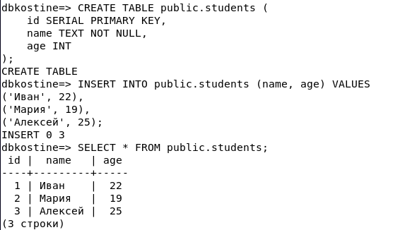

Update delete

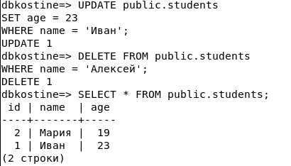

В другую схему

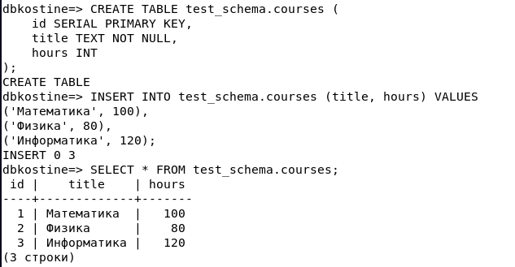

Сейчас, если ты выполняешь: SELECT \* FROM courses;

то PostgreSQL выдаст ошибку, потому что courses находится в test_schema,
а поиск идёт по public.

Чтобы исправить это, установим search_path: SET search_path TO
test_schema, public;

Теперь запрос: SELECT \* FROM courses; будет работать без явного
указания схемы.

**9. Настройка локальных и сетевых подключений**

sudo nano /etc/postgresql/13/main/postgresql.conf

#listen_addresses = \'localhost\'

На

listen_addresses = \'*\'

По умолчанию она закомментирована (# в начале), что означает, что
PostgreSQL использует значение по умолчанию -- localhost, и не принимает
удалённые подключения.

sudo nano /etc/postgresql/13/main/pg_hba.conf

Добавь в конец файла строку

host all all 0.0.0.0/0 md5

**host** -- разрешаем подключение по сети (TCP/IP).

**all** -- разрешаем подключение ко всем базам данных.

**all** -- разрешаем всем пользователям.

**0.0.0.0/0** -- разрешаем доступ всем в сети.

**md5** -- требуем ввод пароля.

После внесения изменений нужно перезапустить PostgreSQL, чтобы они
применились:

sudo systemctl restart postgresql

Проверяем\
ss -tulnp \| grep postgres

ss --- это инструмент для отображения информации о сокетах и сетевых
соединениях.

Смотрим какие порты слушает Postgres\

Узнаём ip постгреса hostname -I\
И подключаемся

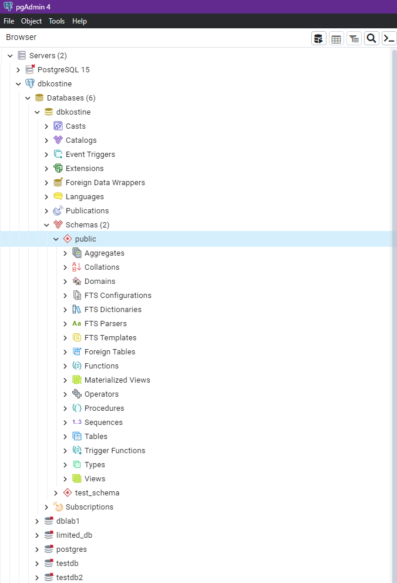

**10. Журналирование (logging)**

sudo nano /etc/postgresql/13/main/postgresql.conf

logging_collector = on \# Включает сбор логов (по умолчанию off)

log_directory = \'pg_log\' \# Директория для логов (по умолчанию
\'log\')

log_filename = \'postgresql-%Y-%m-%d.log\' \# Формат имени лог-файлов

log_statement = \'all\' \# Логировать все SQL-запросы

log_connections = on \# Логировать новые подключения

log_disconnections = on \# Логировать отключения клиентов

log_duration = on \# Логировать время выполнения запросов

log_timezone = \'UTC\' \# Устанавливаем временную зону в логах

Изначально логи писались в /var/log/postgresql стандартный каталог логов
системы, где хранятся логи других сервисов Debian.

После нашей настройки логи стали писаться по пути
/var/lib/postgresql/13/main/pg_log куда сохранются уже логи
исключительно постгреса

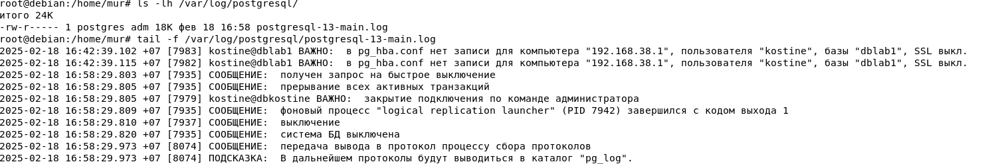

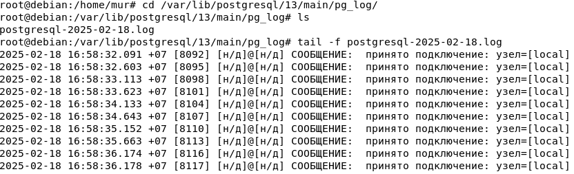

**11. Назначение ролей и прав**

Из под админа создаём отедльную БД и Роль выдаём конкретные права

Даем пользователю limited_user права на базу данных:

GRANT CONNECT ON DATABASE limited_db TO limited_user;

Даем права на схему (если нужно):

GRANT USAGE ON SCHEMA public TO limited_user;

Даем права на таблицу students:

GRANT SELECT, INSERT, UPDATE ON public.students TO limited_user;

Теперь limited_user имеет права на выполнение операций с таблицей
students.

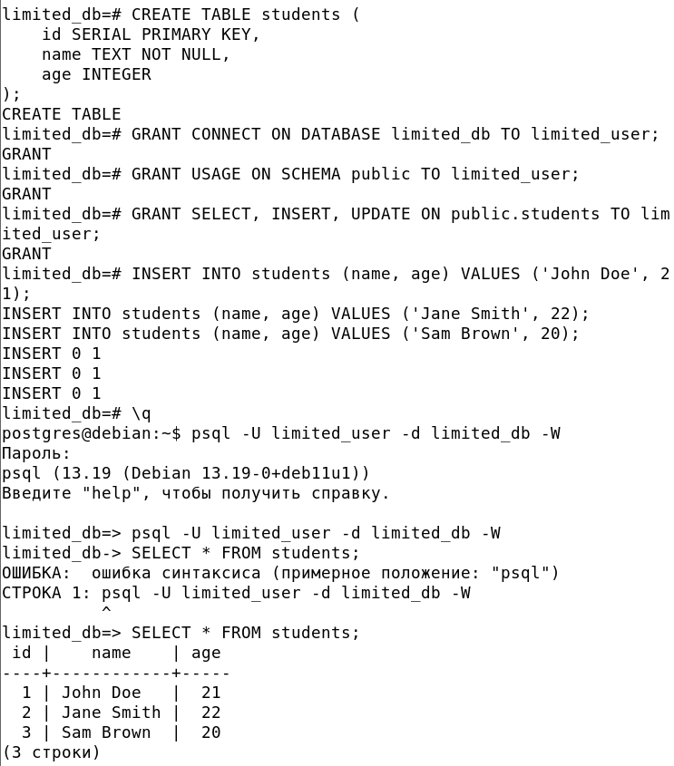

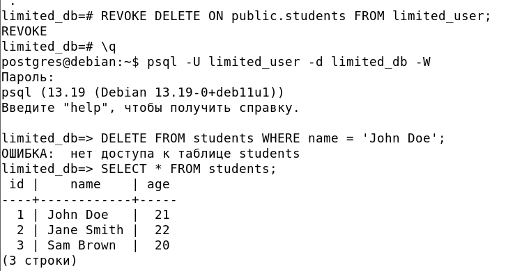

Создаём роль даём нашему юзеру и он получает её права

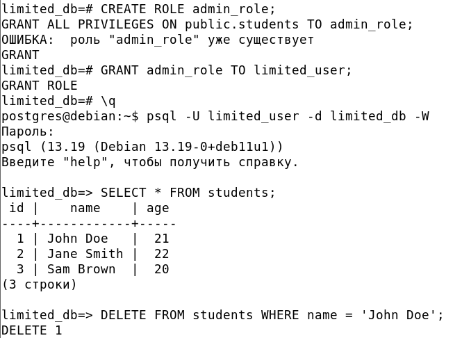
