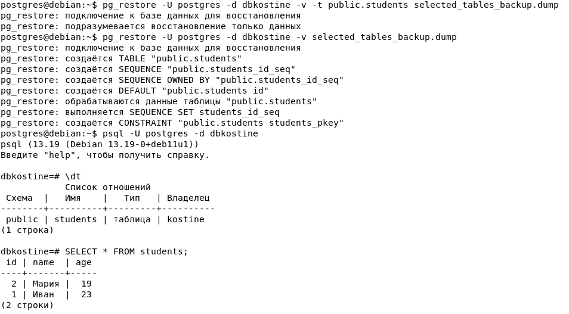
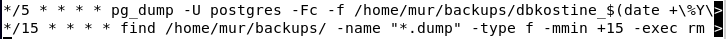

>**Отчет по лабораторной работе №2 резервное копирование, восстановление
>и мониторинг в Debian и PostgreSQL**
>
>**Костина Е.А. ИС-21**

**1. Утилиты резервного копирования: pg_dump и pg_basebackup**

**1.** **pg_dump** --- копия одной базы в виде SQL-файла

Это утилита для резервного копирования только одной базы данных в
текстовом виде. Она создает файл, который содержит SQL-команды (CREATE,
INSERT и т. д.), позволяющие воссоздать базу с нуля.

Когда использовать?

-   Нужно сохранить только одну базу, а не весь сервер.

-   Нужно перенести базу на другой сервер (например, на новый
    PostgreSQL).

-   Нужно получить дамп в виде SQL-файла, который можно редактировать
    перед восстановлением.

Пример команды:

pg_dump -U postgres -Fc -f backup.dump dbkostine

Эта команда делает резервную копию базы dbkostine в сжатый файл
backup.dump.

\_\_\_\_\_\_\_\_\_\_\_\_\_\_\_\_\_\_\_\_\_\_\_\_\_\_\_\_\_\_\_\_\_\_\_\_\_\_\_\_\_\_\_\_\_\_\_\_\_\_\_\_\_\_\_\_\_\_\_\_\_\_\_\_\_\_\_\_\_\_

**2. pg_basebackup** --- полная копия сервера

Эта утилита копирует весь сервер PostgreSQL целиком, включая все базы
данных, настройки, журналы транзакций и файлы данных.

Когда использовать?

-   Нужно сделать полную копию сервера (всех баз, не только одной).

-   Нужно создать реплику базы (например, для отказоустойчивости).

-   Нужно быстро восстановить базу в том же состоянии, в каком она была
    на момент копирования.

Пример команды:

pg_basebackup -U postgres -D /path/to/backup_dir -Ft

Эта команда сохранит полную копию базы в папку /path/to/backup_dir в
формате .tar.

1️ **Что копирует:**

-   pg_dump делает резервную копию **только одной базы данных**.

-   pg_basebackup копирует **весь сервер PostgreSQL**, включая все базы,
    настройки и файлы.

2️ **Формат копии:**

-   pg_dump сохраняет базу в **SQL-файл или архив** (можно открыть и
    редактировать).

-   pg_basebackup делает **физическую копию файлов** базы данных (точную
    копию сервера).

3️ **Размер копии:**

-   pg_dump занимает **меньше места**, так как сохраняет только нужные
    данные.

-   pg_basebackup занимает **больше места**, потому что копирует всё,
    включая временные файлы и журналы транзакций.

4️ **Где удобно использовать:**

-   pg_dump подходит, если нужно **перенести только одну базу** или
    сделать SQL-скрипт для восстановления.

-   pg_basebackup удобен для **создания реплик сервера** и быстрого
    восстановления всей системы.

5️ **Можно ли редактировать копию перед восстановлением?**

-   pg_dump создаёт SQL-файл, который **можно изменять перед
    восстановлением**.

-   pg_basebackup делает точную копию сервера, **редактировать её
    нельзя** -- можно только восстановить как есть.

**2. Создание резервной копии**


pg_dump -U postgres -Fc -f dbkostine_backup.dump dbkostine

-   -Fc --- указывает, что резервная копия должна быть в формате custom
    (сжимаемый формат).

-   -f --- указывает путь и имя файла для резервной копии.

-   dbkostine --- имя базы данных, для которой создается резервная
    копия.

Форматы резервных копий:

-   -F p --- Создаёт дамп в обычном текстовом SQL формате. Это просто
    текстовый файл с SQL-командами для восстановления.

-   -F c --- Создаёт дамп в формате custom, который сжимает данные и
    позволяет выбирать, что восстанавливать.

-   -F t --- Создаёт дамп в формате tar (архив), который подходит для
    перемещения между системами.

-   -t --- Указывает таблицу или таблицы для дампа.

pg_dump -U postgres -Fc -f backup.dump -t public.users dbkostine

-   -n --- Указывает схему для дампа

pg_dump -U postgres -Fc -f backup.dump -n public dbkostine

-   -T --- Исключает таблицу из дампа.

pg_dump -U postgres -Fc -f backup.dump -T public.internal_logs dbkostine

-   -v --- Включает подробный вывод (verbose), показывающий информацию о
    процессе дампа

pg_dump -U postgres -v -f backup.dump dbkostine

-   \--no-owner --- Не сохраняет владельца объектов, что полезно при
    восстановлении на другой сервер.

pg_dump -U postgres \--no-owner -f backup.dump dbkostine

-   -n test_schema --- указывает, что нужно сделать дамп только для
    схемы test_schema.

-   -Fc --- создаёт дамп в формате custom (сжимаемый и удобный для
    восстановления).

-   -f test_schema_backup.dump --- указывает имя файла резервной копии.

**3. Частичное (выборочное) резервное копирование**

Делаем бэкап определённой таблицы


Смотрим что таблица есть


Удаляем


**4. Восстановление из резервной копии**

Востанавливаем проверяем



**5. Автоматизация бэкапов с помощью cron**

Команда, которая открывает файл **crontab** (таблицу заданий
планировщика cron) для редактирования.

Crontab -e



Добавляем задачу для создания резервной копии каждые 5 минут:

В crontab добавляем следующее:

\*/5 \* \* \* \* pg_dump -U postgres -Fc -f
/home/mur/backups/dbkostine\_\$(date +\\%Y\\%m\\%d\\%H\\%M).dump
dbkostine

-   \*/5 \* \* \* \* означает, что команда выполняется каждые 5 минут.

-   pg_dump --- делает резервную копию базы.

```{=html}
<!-- -->
```
-   -U postgres --- использует пользователя postgres.

-   -Fc --- создаёт дамп в сжатом формате PostgreSQL.

-   -f /home/mur/backups/dbkostine\_\$(date +\\%Y\\%m\\%d\\%H\\%M).dump
    --- сохраняет резервную копию в файл, имя которого содержит дату и
    время (год, месяц, день, часы, минуты).

-   dbkostine --- имя базы данных.Изменяем задачу для удаления резервных
    копий старше 15 минут: Мы будем использовать параметр -m в команде
    find для удаления файлов старше 15 минут. В crontab это будет
    выглядеть так:

\*/15 \* \* \* \* find /home/mur/backups/ -name \"\*.dump\" -type f
-mmin +15 -exec rm {} \\;

-   \*/15 \* \* \* \* означает, что команда выполняется **каждые 15
    минут**.

-   find /home/mur/backups/ -name \"\*.dump\" --- ищет все файлы с
    расширением .dump в папке /home/mur/backups/.

-   -type f --- указывает, что ищем только файлы (не папки).

-   -mmin +15 --- выбирает файлы, созданные **более 15 минут назад**.

-   -exec rm {} \\; --- удаляет найденные файлы.


Ротация работает!

**6. Мониторинг состояния системы**

Команда **top**, используется для мониторинга состояния системы в
реальном
времени

-   Всего задач: 212, 1 выполняется, 207 в спящем режиме, 4 остановлены,
    0 зомби --- Общее количество задач, их текущий статус:

    -   total --- общее количество задач.

    -   running --- количество задач, которые сейчас выполняются.

    -   sleeping --- задачи, которые в данный момент не выполняются.

    -   stopped --- задачи, которые остановлены.

    -   зомби --- задачи, которые завершены, но их информация всё ещё
        присутствует в таблице процессов.

-   %Cpu(s): 0,3 us, 0,2 sy, 0,0 ni, 99,5 id, 0,0 wa, 0,0 hi, 0,0 si,
    0,0 st --- Загрузка процессора:

    -   us (пользователь) --- процент времени, которое процессор тратит
        на выполнение пользовательских процессов.

    -   sy (система) --- процент времени, которое процессор тратит на
        выполнение системных процессов.

    -   ni (nice) --- процент времени, которое процессор тратит на
        выполнение процессов с изменённым приоритетом.

    -   id (idle) --- процент времени, когда процессор не занят и
        находится в режиме ожидания.

    -   wa (ожидание) --- процент времени, в течение которого процессор
        ожидает ввода-вывода.

    -   hi (аппаратное прерывание) --- процент времени, затраченного на
        обработку аппаратных прерываний.

    -   si (программное прерывание) --- процент времени, затраченного на
        обработку программных прерываний.

    -   st (крадёт) --- процент времени, когда виртуальная машина
        «крадёт» время у других виртуальных машин (для
        виртуализированных систем).

3\. Память

-   Mib Mem: всего 1935,2, свободно 475,2, используется 730,9,
    буферизовано/кэшировано 729,2 --- Статистика оперативной памяти:

    -   total --- общий объём памяти.

    -   free --- количество свободной памяти.

    -   used --- количество использованной памяти.

    -   buff/cache --- память, которая используется для кэширования и
        буферизации.

-   Mib Swap: всего 975,0, свободно 975,0, используется 0,0 ---
    Статистика по swap-памяти (виртуальной памяти):

    -   total --- общий объём swap.

    -   free --- количество свободного swap.

    -   used --- количество использованного swap.

-   1026,8 доступная память --- доступная для использования память.

4\. Строки с процессами

Для каждого процесса отображаются следующие столбцы:

-   PID --- Идентификатор процесса.

-   USER --- Пользователь, которому принадлежит процесс.

-   PR --- Приоритет процесса. Чем меньше число, тем выше приоритет.

-   NI --- Значение приоритета процесса. Может быть изменено с помощью
    команды nice.

-   VIRT --- объём виртуальной памяти, который использует процесс
    (включая все библиотеки и сопоставления).

-   RES --- объём физической памяти, используемой процессом (не включает
    swap).

-   SHR --- размер общей памяти, используемой этим процессом и другими
    процессами.

-   S --- Состояние процесса:

    -   S --- спящий процесс.

    -   R --- процесс выполняется.

    -   I --- процесс ожидает.

    -   Z --- зомби процесс.

    -   T --- процесс остановлен.

    -   D --- процесс в режиме ожидания.

-   %CPU --- Процент времени процессора, который использует процесс.

-   %MEM --- Процент памяти, который использует процесс.

-   TIME+ --- общее время работы процесса, которое он потратил на
    выполнение.

-   COMMAND --- Имя процесса или команды, которая его запускает.

Пример:

-   Процесс с PID 588 --- это процесс пользователя postgres, который
    использует 0,1% ЦП и 1,5% памяти. Он находится в состоянии I
    (ожидание), что может означать, что процесс не выполняется активно,
    а просто занимает некоторое время в ожидании.

-   Процесс с PID 1409 --- это процесс пользователя mur, который
    использует 3,6% ЦП и 12,41% памяти. Этот процесс активно
    выполняется.

**7. Мониторинг PostgreSQL**

pg_stat_activity --- мониторинг активных процессов в PostgreSQL.

Это представление показывает все активные соединения, их текущие
состояния и выполняющиеся запросы.

Чтобы увидеть активные процессы и запросы

SELECT pid, usename, application_name, state, query, query_start

FROM pg_stat_activity

WHERE state = \'active\';


-   pid --- идентификатор процесса.

-   usename --- имя пользователя, выполняющего запрос.

-   application_name --- название приложения, которое инициировало
    запрос.

-   state --- состояние процесса

Смотреть все процессы

SELECT pid, usename, application_name, state, query, query_start

FROM pg_stat_activity;


Для поиска запросов, которые выполняются слишком долго, можно
использовать следующую команду:

SELECT pid, usename, application_name, state, query, query_start

FROM pg_stat_activity

WHERE state = \'active\'

AND now() - query_start \> interval \'5 minutes\';


pg_stat_database -- позволяет получать **статистику работы баз данных**
в PostgreSQL

SELECT datname, numbackends, xact_commit, xact_rollback, blks_read,
blks_hit

FROM pg_stat_database;

-   **datname** --- имя базы данных.

-   **numbackends** --- количество активных подключений (процессов
    backend), работающих с этой базой.

-   **xact_commit** --- количество **успешно зафиксированных (COMMIT)
    транзакций**.

-   **xact_rollback** --- количество **отменённых (ROLLBACK)
    транзакций**.

-   **blks_read** --- количество блоков данных, **прочитанных с диска**.

-   **blks_hit** --- количество блоков, **найденных в кеш-памяти**
    PostgreSQL (shared buffers), без обращения к диску.


Принудительное завершение запроса:

Например, если ты нашел запрос, который выполняется слишком долго, и
хочешь его завершить, можешь использовать команду:

SELECT pg_terminate_backend(pid)

FROM pg_stat_activity

WHERE state = \'active\'

AND now() - query_start \> interval \'5 minutes\';

Эта команда завершит запросы, которые выполняются дольше 5 минут.

**8. Логирование и анализ логов**

Логи постгреса


Логи всего дебиана


Разница между логами PostgreSQL и системными логами Debian

-   Логи PostgreSQL фокусируются на событиях, происходящих внутри базы
    данных, таких как запросы, ошибки выполнения запросов,
    подключение/отключение пользователей и состояние транзакций.

-   Системные логи Debian содержат информацию о работе самой
    операционной системы, включая загрузку системы, работу ядра, ошибки
    оборудования, а также работу системных сервисов.
