**Отчет по лабораторной работе №3 Расширенные возможности и оптимизация
PostgreSQL на Debian**

**Костина Е.А. ИС-21**

**1. Оптимизация конфигурации PostgreSQL**

**shared_buffers --- размер буферного кеша PostgreSQL**

-   Используется для хранения данных в оперативной памяти, уменьшает
    количество чтений с диска.

-   Рекомендуемое значение: **25-40% от RAM**.

**work_mem --- память для операций сортировки и хеширования**

-   Используется для ORDER BY, JOIN, DISTINCT.

-   Значение зависит от количества одновременно выполняемых запросов.

**maintenance_work_mem --- память для операций VACUUM, CREATE INDEX**

-   Чем больше значение, тем быстрее выполняются администраторские
    операции.

-   Обычно **10-15% от RAM**.

**effective_cache_size --- кеш чтения ОС**

-   PostgreSQL оценивает, сколько страниц данных может быть кэшировано в
    оперативной памяти перед обращением к диску.

-   Обычно **50-75% от RAM**.

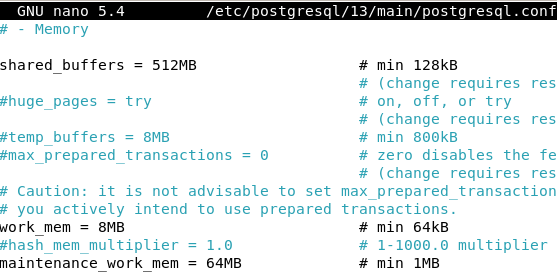

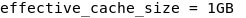

Чтобы настройки применились перезапускаем sudo systemctl restart
postgresql

Проверяем

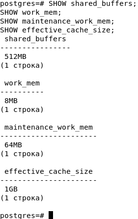

**2. Создание и анализ индексов**

Создадим таблицу и заполним числами

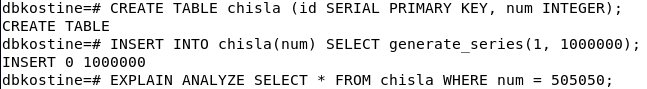

С помощью команды EXPLAIN ANALYZE SELECT \* FROM chisla WHERE
customer_id = ;

Проверяем время необходимое для выполнения запроса

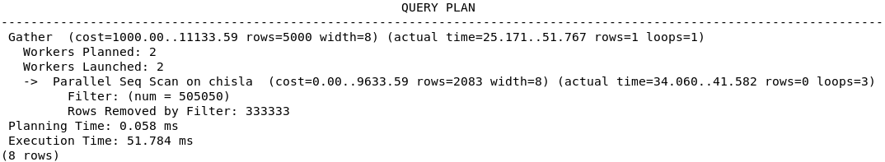

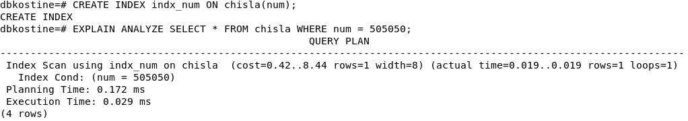

Видим что после создания индексов время на выполнения запроса
значительно сократилось

Когда выполняется запрос **без индекса**:

PostgreSQL **просматривает всю таблицу (Seq Scan)**:

1.  Читает **каждую строку** в chisla.

2.  Сравнивает customer_id с 500.

3.  Возвращает подходящие строки.

PostgreSQL **использует индекс** (Index Scan), а не Seq Scan:

1.  Заглядывает в **индекс**, чтобы сразу найти строки с customer_id =
    500.

2.  Достаёт только нужные строки.

3.  **Хранимые функции**

Создаём функцию insert_chislo

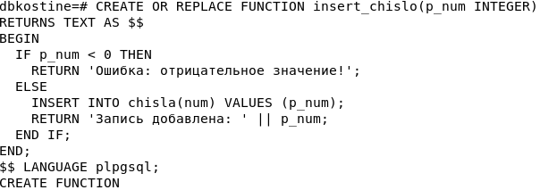

Проверяем что всё работает как задумывалось

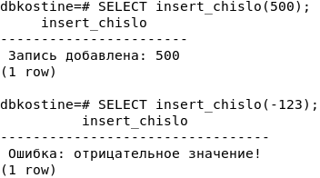

**4. Триггеры**

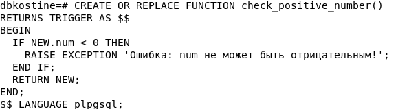

OR REPLACE если такая функция уже существует, она перезаписывается.

RETURNS TRIGGER указывает, что это функция для триггера.

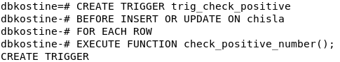

FOR EACH ROW Если запрос изменяет несколько строк одновременно, триггер
проверит каждую из них.

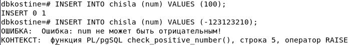

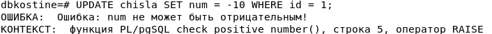

Всё работает

**5. Автоматическая очистка и статистика (VACUUM, ANALYZE)**

Пример параметров вакума

autovacuum_naptime = 30s \# Интервал проверки таблиц (по умолчанию 1
мин) autovacuum_vacuum_scale_factor = 0.05 \# Когда начинать очистку (5%
\"мусорных\" строк) autovacuum_analyze_scale_factor = 0.02 \# Когда
обновлять статистику (2% изменённых строк)

Проверяем что автовакум включен

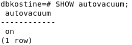

Удалит «мёртвые» строки + обновит статистику для оптимального выполнения
запросов.

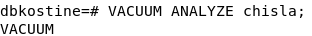

VACUUM удаляет **«мёртвые» строки** и освобождает место.

ANALYZE обновляет статистику, чтобы **оптимизировать планы запросов**.

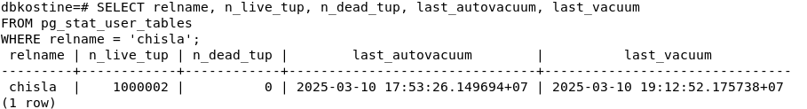

**relname** --- имя таблицы.

**n_live_tup** --- активные строки.

**n_dead_tup** --- «мёртвые» строки (чем их больше, тем хуже).

**last_autovacuum** --- когда последний раз запускался autovacuum

**last_vacuum** -- время последнего **ручного VACUUM**.

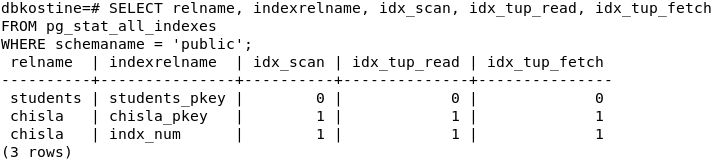

**relname** --- имя таблицы.

**indexrelname** --- имя индекса.

**idx_scan** --- сколько раз индекс использовался.

**idx_tup_read** --- сколько строк прочитано с индексом.

**idx_tup_fetch** --- сколько строк реально использовано.
